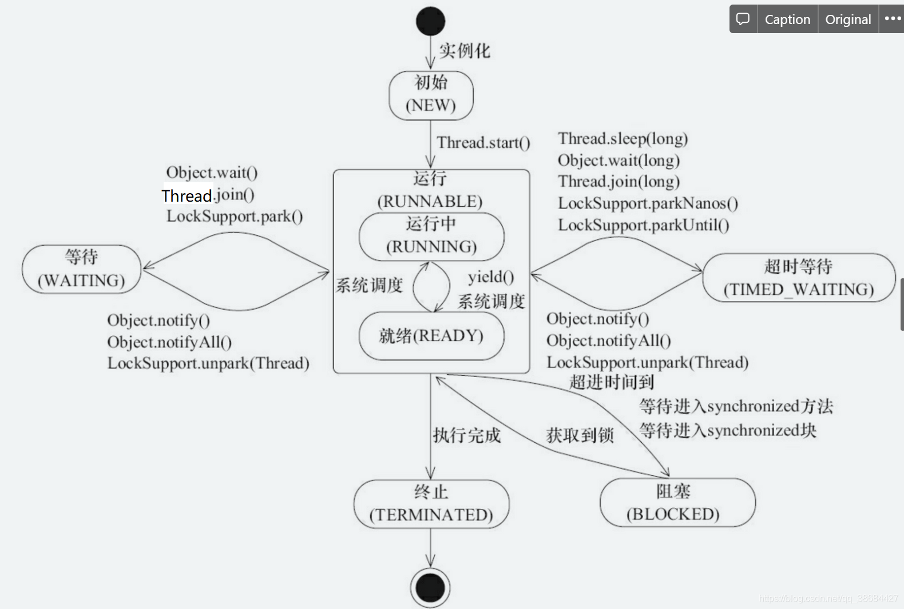

## 进程和线程

#### 进程

进程是程序的一次执行过程，是系统运行程序的基本单位，因此进程是动态的

系统运行一个程序即是一个进程从创建、运行到消亡的过程

java中，启动main函数就是启动了一个JVM进程，而main函数所在的线程就是这个进程中的一个线程，也称主线程

#### 线程

线程是比进程更小的执行单元，一个进程在执行过程中可以产生多个线程

同类的多个线程共享进程的堆和方法区的资源

每个线程有自己的**程序计数器、虚拟机栈和本地方法栈**

系统在产生一个线程，或是在各个线程之间作切换，负担要比进程小很多，所以，线程也是轻量级进程

#### 关系

多个线程共享进程的堆和方法区（元空间 资源，但是每个线程有自己的程序计数器、虚拟机栈和本地方法栈

基本上各进程是独立的，而各线程则不一定，同一进程中的线程极有可能会相互影响

线程执行开销小，但不利于资源的管理和保护，而进程正相反

#### 程序计数器

* 字节码解释器通过改变程序计数器来依次读取指令，从而实现代码的流程控制，如：顺序执行、选择、循环、异常处理
* 多线程情况下，程序计数器用于记录当前线程执行的位置，从而当线程被切换会俩的时候能够知道该线程上次运行位置

> 如果执行的是native方法，那么程序计数器记录的是undefined地址；只有执行的是java代码时程序计数器记录的才是下一条指令的地址

程序计数器私有的主要目的是为了线程切换后能恢复到正确的执行位置

#### 虚拟机栈和本地方法栈

虚拟机栈：每个java方法在执行的同时会创建一个栈帧用于存储局部变量表、操作数栈、常量池引用等信息\
从方法调用直至执行完成的过程，就对应着一个栈帧在java虚拟机栈中入栈和出栈的过程

本地方法栈：虚拟机栈为虚拟机执行java方法（也就是字节码 服务，而本地方法栈则为虚拟机使用到native方法服务\
在HotSpot虚拟机中和java虚拟机栈合二为一

私有保证线程中局部变量不被别的线程访问到

堆和方法区是所有线程共享的资源，其中堆比较大（主要存放新建的对象（几乎所有的对象都在这里分配内存\
方法区主要用于存放已被加载的类信息、常量、静态变量、即时编译器编译后的代码等数据

## 并发与并行

并发：多个以上的作业在同一**时间段**内执行

## 多线程

多线程可以提高系统的并发能力以及性能

相对于进程：线程更加轻量，是程序执行的最小单位；线程间的切换和调度的成本远远小于进程\
多核cpu意味着多个线程可以同时运行，减少了线程上下文切换的开销

单核情况下：使用多线程主要是为了提高单进程利用cpu和IO系统的效率

    假设只运行一个java进程，一个线程，请求IO的时候，此线程被IO阻塞，则整个进程被阻塞。cpu和IO设备永远只有一个
    在运行；这时，简单认为系统的效率为50%；当使用多线程的时候，一个线程被IO阻塞，其他线程还可以使用cpu...,可以
    提高了java进程利用系统资源的整体效率

多核情况下：多线程主要是为了提高进程利用多核cpu的能力；一个进程一个线程的情况下，无论系统有几个cpu核心，
都只会有一个cpu核心被利用到；创建多线程，这些线程可以被映射到底层多个cpu上执行，在任务中多个线程没有资
源竞争的情况下，任务执行的效率会有显著的提高，=单核时间数/cpu核心数

并发线程并不总是能提高程序运行速度，而且并发线程会遇到：内存泄漏、死锁、线程不安全...

## 线程状态

1.new 新建，线程被创建，但是还没有调用start方法\
2.runnable 运行（java没有就绪状态，把就绪和运行一起称为运行\
3.blocked 阻塞，表示线程阻塞于锁\
4.waiting 等待，进入该状态表示当前线程需要等待其他线程做出一些 通知|中断 动作\
5.timed_waiting 有时间的等待，可以自己通知自己，指定时间自行返回\
6.terminated 终止，表示当前线程一级执行完毕

```java
public class MyThread {
    /**
     * <p> Thread.State 以下内容摘自State
     * <p> These states are virtual machine states which do not reflect
     * any operating system thread states.
     * <p> 这些状态是 不反映任何操作系统线程状态 的虚拟机状态。
     * <p>
     * <p> Thread.State.RUNNABLE 以下内容摘自RUNNABLE
     * <p> A thread in the runnable
     * state is executing in the Java virtual machine but it may
     * be waiting for other resources from the operating system
     * such as processor.
     * <p> 处于可运行状态的线程正在 Java 虚拟机中执行，但它可能正在等待来自操作系统的其他资源，例如处理器。
     * <p>
     * @see Thread.State
     */
    private void state() {

    }
}
```

在操作系统层面有ready和running状态，而在JVM层面只能看到runnable状态

调用start方法后开始运行，线程这时候处理ready状态；可运行状态的线程获得了cpu时间片（timeslice 后就处于running状态

线程的状态切换如下图所示：（图源：《Java并发编程艺术》 4.1.4节



在操作系统层面线程有ready和runnable状态；在JVM层面只能看到runnable状态
> （摘自：[java线程运行怎么有第六种状态？ - Dawell的回答](https://www.zhihu.com/question/56494969/answer/154053599) ） 
> 现在的<b>时分</b>（time-sharing）<b>多任务</b>（multi-task）操作系统架构通常都是用所谓的“<b>时间分片</b>（time quantum or time slice）”方式进行<b>抢占式</b>（preemptive）
> 轮转调度（round-robin式）。这个时间分片通常是很小的，一个线程一次最多只能在 CPU 上运行比如 10-20ms 的时间（此时处于 running 状态），也即大概只有 0.01 秒这一量级，时间片用
> 后就要被切换下来放入调度队列的末尾等待再次调度。（也即回到 ready 状态）。线程切换的如此之快，区分这两种状态就没什么意义了。
> 
> 参考上面的注释（均摘自源码; runnable包含ready和running状态；主流JVM会把java的线程映射到操作系统底层的线程上，把调度委托给了操作系统，
> 我们能在虚拟机层面看到的状态是对底层状态的映射和封装。JVM本身没有做实质上的调度，因为底层ready和running状态切换较快，而java线程状态
> 是服务于监控的，区分2种意义不大（存疑），因此JVM做成了一种
> 
> 时间分片一次在cpu上运行的时间为15ms左右（不准确），也就是说running状态一共执行15ms就切换到ready状态了（也有可能15ms就结束了，变成其他状态了

## 上下文切换

线程再执行过程中会有自己的运行条件和状态（也称上下文），比如程序计数器、栈信息等\
当出现如下情况的时候，线程会从占用cpu状态退出\
* 主动让出cpu；例如sleep，wait
* 时间分片用完；操作系统要防止一个线程或进程长时间占用cpy导致其他线程饿死
* 调用阻塞类型的系统中断；比如请求IO，线程被阻塞
* 被终止或结束运行


