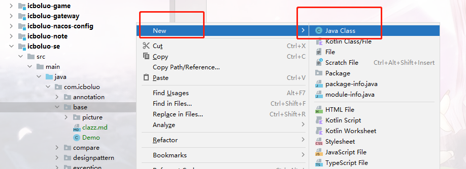
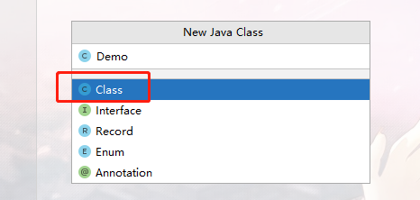
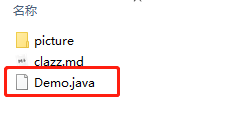
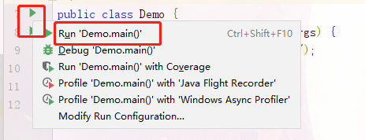
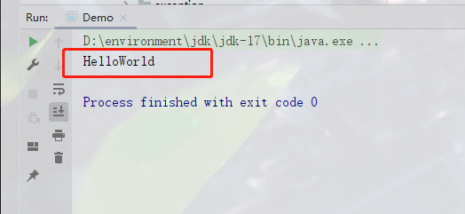

## 什么是Class(类)

* 如下图在Idea中右键->new->Java class创建出来的文件叫Class
  
* 
* 看一下Demo Class在文件夹中长什么样
* 
* Idea自动生成的Class的内容如下

```java
// 包路径，也是相对路径
package com.icboluo.base;
// 文档注释

/**
 * @author icboluo
 * @since 2022-04-28 21:52
 */
// public 权限修饰符，表明可以被谁所访问
// class 表明是一个类
// Demo 类名
// {}除了导包所有的代码都要在大括号里面写
public class Demo {
}
```

## 写一个HelloWorld

```java
public class Demo {
    // public 权限修饰符
    // static 表明方法是静态方法
    // void 表明方法没有返回值
    // main 方法名
    // String[] 参数类型
    // args 形参
    public static void main(String[] args) {
        // System 系统类
        // .out 小数点代表调用，调用系统类的out方法
        // .println 调用系统的out的println方法
        // "HelloWorld" 字符串HelloWorld
        System.out.println("HelloWorld");
    }
}
```

#### 启动

* 如下图所示，第7行第8行均有一个三角标记，随便点一个然后点run...即可（也可以点击debug启动
  
* 控制台打印消息会在下方弹出
  

## 认识数据类型

* Java中有2类数据类型

> 1.基本数据类型\
> 2.引用数据类型

* 除了基本数据类型，剩下的都是引用数据类型，基本类型有下面8种

```java
public class Demo {

    public static void main(String[] args) {

        byte by = 0;
        short sh = 1;
        int i = 2;
        long lon = 3;

        float flo = 4.4F;
        double dou = 5.5;

        char ch = '6';
        boolean bool = true;

        // 字符串不属于基本数据类型
        String str = "888";
    }
}

```

## 方法调用

* 一个方法调用另一个方法怎么实现

```java
public class Demo {

    // 主方法是入口，写法是固定的，快捷键psvm
    public static void main(String[] args) {
        // 调用子方法，传入2个实际参数，并且获得方法的返回值sum
        int sum = sum(3, 9);
        // 打印子方法返回值，快捷键sout
        System.out.println(sum);
    }

    // int：返回值类型为基本数据类型int
    // int a：参数类型int，形参a
    // int b：参数类型int，形参b，用逗号隔开
    public static int sum(int a, int b) {
        // 基本数据类型的运算
        int sum = a + b;
        return sum;
    }
}
```

## 交换数组中的2个元素并打印结果

```java
public class Demo {
    // 交换第二个和第四个元素的位置
    public static void main(String[] args) {
        // 定义一个仅包含int类型元素的数组
        int[] arr = {8, 9, 4, 1, 6};
        swap(arr, 2, 4);
        // for循环，快捷键arr.fori (arr代表形参
        for (int i = 0; i < arr.length; i++) {
            // print表示不换行打印
            System.out.print(arr[i] + " ");
        }
    }

    // 交换函数
    public static void swap(int[] arr, int a, int b) {
        int temp = arr[a];
        arr[a] = arr[b];
        arr[b] = temp;
    }
}
```

## Scanner

```java
// 导包，用于控制台输入，快捷键alt+enter

import java.util.Scanner;

public class Demo {
    public static void main(String[] args) {
        // 固定写法
        Scanner sc = new Scanner(System.in);
        // 当输入拥有下一行的时候
        while (sc.hasNextLine()) {
            // 打印下一行信息
            System.out.println(sc.nextLine());
        }
    }
}
```

## 面向对象

* 对于一个学生类，拥有多个学生对象

```java
// 对于对象来说，不需要static静态关键字
public class Student {
    // public 权限修饰符
    // int 属性类型
    // age 属性名称
    // 年龄属性
    public int age;

    // 姓名属性
    public String name;

    // 上课方法
    public void attendClass1() {
        System.out.println("上课");
    }

    // 有姓名的上课方法
    public void attendClass2() {
        System.out.println(name + "正在上课");
    }
}
```

* 测试类

```java
public class StudentTest {
    public static void main(String[] args) {
        // 新建一个学生对象
        Student student1 = new Student();
        // 该学生去上课了，调用到学生类的上课函数
        student1.attendClass();
        Student student2 = new Student();
        // 给属性赋值
        student2.name = "张三";
        student2.attendClass2();
    }
}
```

## String对象

* 字符串是一个常用的类，先学习常用的字符串API(ApplicationInterface)

```java
public class StudentTest {
    public static void main(String[] args) {
        // 新建一个字符串对象
        String str = new String("字符串dfjgoagja");

        // 判断str对象和输入的参数是否相等
        boolean equals = str.equals("dgaga");
        // 把字符串中所有的a字符用 +++替换
        String replace = str.replace("a", "+++");
        // 把字符串转换称为字符数组
        char[] chars = str.toCharArray();
        // 把字符串中的字母均转换为小写
        String lowerCase = str.toLowerCase();
        // 求字符串的长度
        int length = str.length();
    }
}
```

## LocalDate LocalTime LocalDateTime对象

java操作日期的工具

参考[LocalDate使用](../../../../../../../icboluo-common/icboluo-base/src/main/java/com/icboluo/util/DateHelper.java)

## ArrayList 对象

容器：存放多个对象的地方

```java
import java.util.ArrayList;

public class StudentTest {
    public static void main(String[] args) {
        // 新建一个容器对象
        ArrayList<Integer> list = new ArrayList<>();
        // 容器添加元素5
        list.add(5);
        // 容器添加元素7
        list.add(7);
        // 容器移除元素5
        list.remove(Integer.parseInt(9));
        // 容器移除第0个元素
        list.remove(0);
        // for循环元素，快捷键list.fori  list为形参可以改变
        for (int i = 0; i < list.size(); i++) {
            // 获取第i个元素
            Integer item = list.get(i);
            // 打印该元素
            System.out.println(item);
        }
    }
}
```

## HashMap对象


