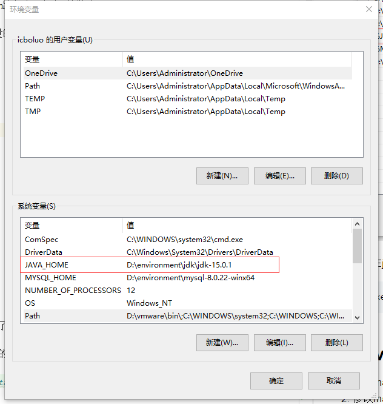
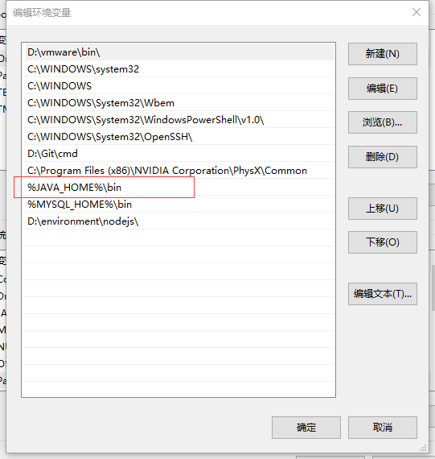
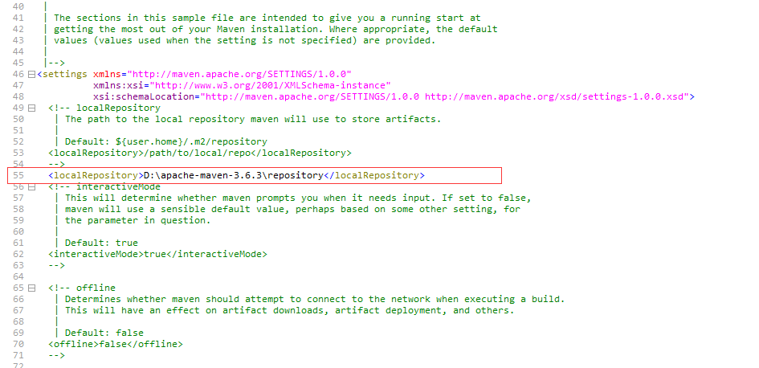
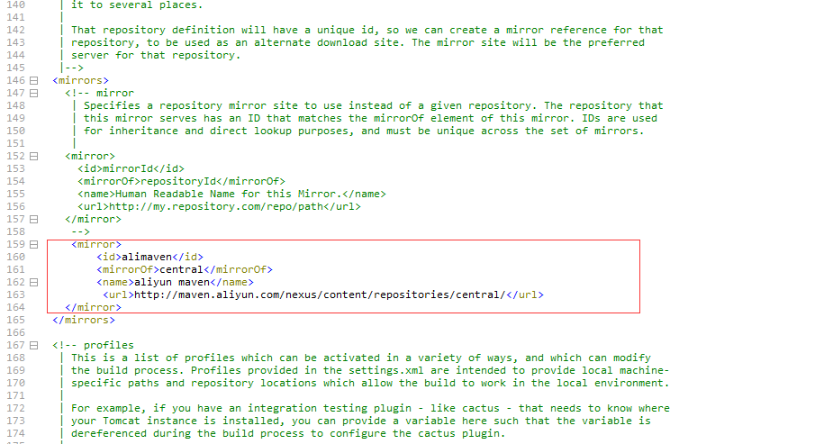
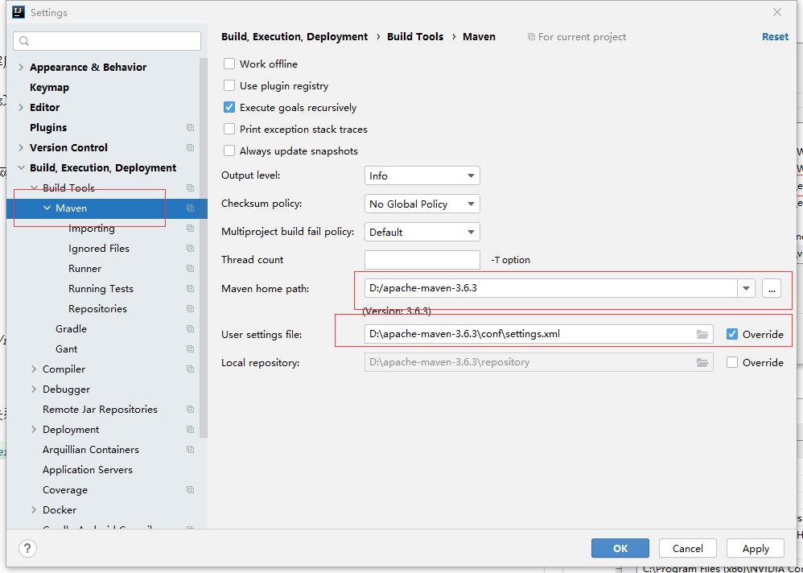

# 软件的安装与配置

## ReadMe

- 本教程用于java生态圈的软件安装指导

- 本教程下的所有说明，只建议有经验的人使用，因为本教程没有过多的解释，自认为比较简单或者已经熟练记忆的步骤就没有再列举出来，小白使用可能感觉步骤不全，寸步难行，请参考其他资料
 

## 1.环境变量

其实呢，环境变量配置的原则只有一个，把软件的bin目录配给path路径中一般有2种做法

- 直接在path路径中写入安装目录，比如第二张图中的git环境变量的配置
- 先写环境变量，再到path中引入环境变量，例如下面的步骤

以JAVA_HOME为例：

1. 将java的安装目录配成系统变量
   
   
   
2. 将系统变量引入path路径

   

3.测试：在jdk安装目录下面的bin目录里面运行

```
javac.exe
```

## 1.maven

1. 百度maven（建议下载压缩包）直接解压，按下面的步骤来就行了

2. 修改maven的依赖下载地址，在config文件中修改，就是把53行的代码复制在注释外，修补一下

   
   
3. 修改下载源地址（默认的下载源是外网的，效率低，用阿里云覆盖）

   
   
   ```
   <mirror>
       <id>alimaven</id>
       <mirrorOf>central</mirrorOf>
       <name>aliyun maven</name>
       <url>http://maven.aliyun.com/nexus/content/repositories/central/</url>
   </mirror>
   ```

5. idea设置，修改idea和maven的链接关系

   

5. idea设置，修改run

   ```
   -DarchetypeCatalog=internal
   ```

6. 实测用idea这样配的话，不写MAVEN_HOME也没有什么关系

## 2.gradle

1. 直接在安装目录下放一个init文件就可以了，init文件在同级目录下,注意将.bak后缀去掉

   

   ```
   bin：gradle.bat 用gradle构建项目
   caches:放一下jar包
   其他的是一些运行环境和jar包
   ```

2. 配置idea gradle为下面这样

   

3. 安装环境变量 gradle -v 测试

4. 环境变量中如果额外加 GRADLE_USER_HOME 并指向maven，以后gradle的jar包就会去maven仓库去找

   不需要再path里面加

## 3.虚拟机

1. 安装虚拟机，官网下载，百度一个秘钥就行了，很简单

2. 下载镜像

   下载镜像的时候选大一点的，小的几百兆的需要联网下载其他的文件，一直联网失败，不知道为啥

3. 新建虚拟机，配置安装镜像

   - 安装网络适配器要安装2个，一个net，一个仅主机模式的

   - 安装镜像的时候，一定要好好选，不要默认直接安装，要在软件选择里面改成服务器，要不然就成图形化界面了

   

4. 选择安装服务器客户端工具 FinalShell

5. 如果主机给虚拟机分配的地址不是192.168，就还原几次默认配置就好了

## 4.jdk

1. 安装jdk15，直接官网下载压缩包解压

2. 配置环境变量(JAVA_HOME)

3. 在jdk安装目录下面的bin目录里面运行

```
javac.exe
```

## 5.redis

1. 虚拟机里面安装redis 我安装的目录是
```
cd usr/local/bin/redis-6.0.5/
```

2. 使用下面的命令启动redis

```
src/redis-server
```

注意安装redis的时候需要c++环境，虚拟机要yum安装一些c++环境，具体百度吧

yum -y install gcc-c++; yum install make;

需要配置开机启动和后台运行

3.windows安装的时候，直接下载压缩包，然后解压就可以了

## 6.nodejs

Node.js是一个Javascript运行环境(runtime)；

npm 是 nodejs 的包管理和分发工具。它可以让 javascript 开发者能够更加轻松的共享代码和共用代码片段，并且通过 npm 管理你分享的代码也很方便快捷和简单。通过npm可以更方便的引用和分析基于nodejs开发的类库和插件。

1.下载安装包。下一步下一步完成就可以了

2.打开cmd，用下面的2个命令，检验是否安装成功（安装过程默认配置好了环境变量，不需要自己配置）

```
node -v
npm -v
```
3.注意安装完成在cmd中可以检验是否安装成功，但是idea需要重新启动一下

## 7.vue

idea做vue项目需要加一个vue插件,加了之后就可以创建vue项目了

1.设置使用淘宝cnpm

```
npm config set registry https://registry.npm.taobao.org
```
2.查看是否配置成功，成功后即可直接使用cnpm命令
```
npm config get registry
```
3.还原npm仓库
```
npm config set registry https://registry.npmjs.org
```

安装vue命令（全局）：需要先配镜像
```
cnpm install vue-cli -g
```
检验vue是否安装好：
```
vue -V
```
vue 安装好之后，初始化web包
```
vue init webpack demo
```
写vue需要满足代码格式，改一下idea的配置就可以了
```
npm install axios
```
安装axios

## 8.nacos

`https://github.com/alibaba/nacos/releases`下载压缩包解压进入bin目录双击就可以启动了

## 9.sentinel

https://github.com/alibaba/Sentinel/releases 下载jar包


